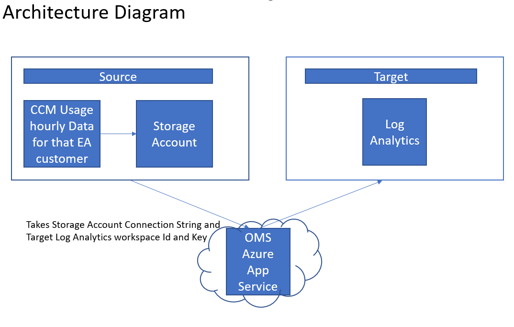
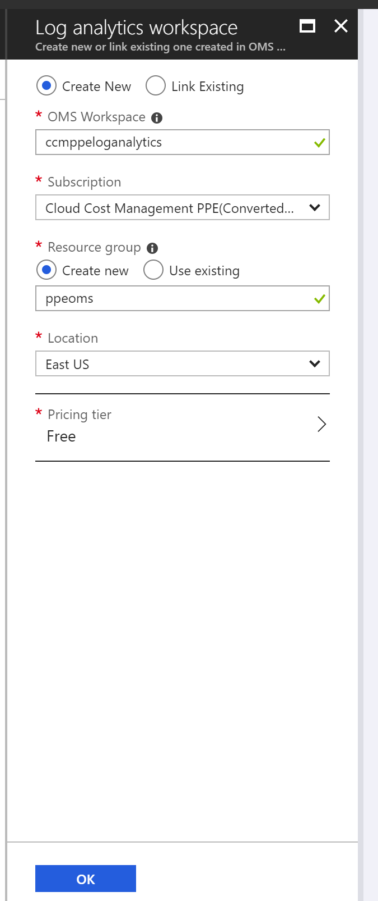
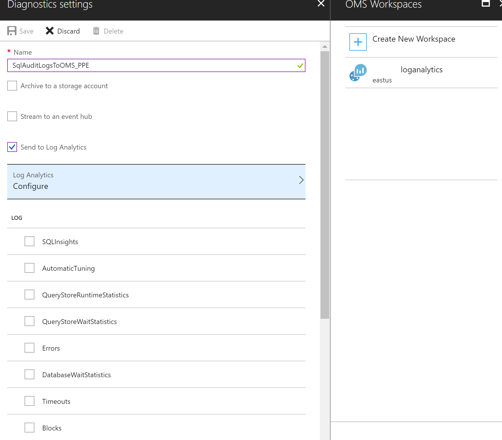
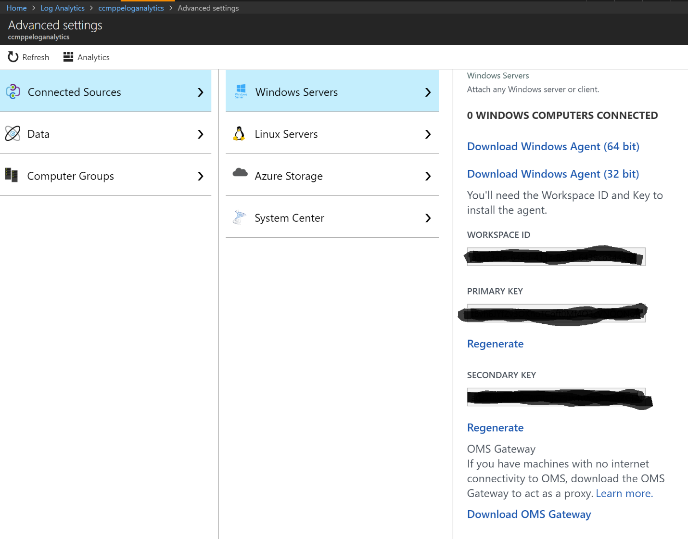

[Moving Usage logs to Log Analytics]{.underline}

Scenario: Customers would like to want their usage data to be moved to
Log Analytics.

{width="6.5in" height="4.133333333333334in"}

Pre-requisites:

-   Visual Studio 2017 (Download from
    [here](https://visualstudio.microsoft.com/vs/whatsnew/).)

-   Azure Functions and WebJobs Tools (Download from
    [here](https://marketplace.visualstudio.com/items?itemName=VisualStudioWebandAzureTools.AzureFunctionsandWebJobsTools))

Step 1: Create a Log Analytics workspace in the subscription you want to
see the usage for

Go to the portal
<https://ms.portal.azure.com/#blade/HubsExtension/Resources/resourceType/Microsoft.OperationalInsights%2Fworkspaces>

{width="6.5in" height="6.714235564304462in"}

Click Add button and fill the Workspace details.

{width="3.7875in" height="8.239583333333334in"}

2\. Enable SqlAuditLogs on the Sql Server Database on the subscription
you want. You can see that the newly created workspace.

{width="6.5in" height="5.691666666666666in"}

{width="6.5in" height="2.49375in"}

Once the sql audit logs are being enabled to go into Log Analytics, lets
work on moving the usage data to Log Analytics.

4\. Get the code from Git Hub and build the application. There are 2
projects in that solution.

Function App, which is a time, triggered and the core dll. This function
app runs every 1 hour. You can change the frequency by changing the cron
expression. This if found in UCDDHourlyToOMS.cs file.

public static void Run(\[TimerTrigger(\"0 0 \*/1 \* \* \*\")\]TimerInfo
myTimer, TraceWriter log)

The Function App UCDDHourly2OMSFuncApp needs the following secrets to be
created in KeyVault.

1.  ucddhourlyconnstring:

    a.  The connection string of the storage account where the usage
        data was stored.

2.  Ucddhourlyblobcontainername: The blob container name

3.  omsworkspaceid

    i.  The oms workspaceId can be found in the advanced settings of the
        Log Analytics

4.  omsworkspacekey

    ii. This is the Primary key that can be found in the advanced
        settings of Log Analytics

5.  {width="6.495138888888889in"
    height="5.088888888888889in"}

6.  Get the Connection String of the storage account where the usage
    data is available.

7.  Open a new browser and go to the KeyVault where you would want to
    store and create the secrets.

8.  Once its created copy the Keyvault url and paste in the
    localsettings.json file in UCDDToOMSFun project.

9.  Now let's publish the Function App to Azure.

10. Open the project in VS2017 and find the UCDDToOMSFunc project.

{width="6.197916666666667in"
height="4.9375in"}

11. Right click on the project and hit Publish. We first need to create
    a profile which has the subscription details, Resource Group,
    Storage Account and what APP Service Plan you want to use.

{width="6.5in"
height="6.510416666666667in"}

12. Click Create new profile

{width="6.5in" height="3.109027777777778in"}

13. Select Create new Azure Function App

{width="6.5in"
height="4.601388888888889in"}

14. Give an appropriate name and select the subscription where it has to
    run.

15. {width="6.5in"
    height="4.600694444444445in"}

16. Select the right App Service Plan. If your data size compressed in
    around 10 MB (gzip compression), then selecting smaller SKUs is not
    enough for processing. So, pick the size depending on the size of
    usage data.

{width="5.864583333333333in"
height="6.239583333333333in"}

17. Hit Create

18. {width="6.5in"
    height="5.165277777777778in"}

19. It starts deploying the host services the Function App needs.

    {width="6.5in"
    height="4.281944444444444in"}

    Once deployment is completed you should be able to see the App
    Service and the FuncApp that got created. The function App is still
    empty, and no functions are deployed. You can search in the
    subscription for resource type "Function Apps"

    {width="6.5in" height="2.829861111111111in"}

    Now we need to go the App Settings in the portal for that Function
    App. Whatever settings we have in localsettings.json need to be
    copied to App Settings. Add "KeyVaultURL" setting.

    Next we need to enable Managed Service Identity to give Azure
    Identity to this Func App. Go to Platform Features and find

    {width="6.5in" height="4.301886482939633in"}

    {width="4.604166666666667in"
    height="3.3333333333333335in"}

    Hit Save.

    Now we need to go to the Keyvault where we stored our secrets and
    give this newly created MSI of Func App access to secrets.

    Go to KeyVault -\> Access policies and click Add New

    {width="5.135416666666667in"
    height="5.46875in"}

    And in Select Prinicpal search for Function App.

    {width="6.5in"
    height="4.895833333333333in"}

    And select Get and List in Secret permissions.

    {width="3.75in"
    height="6.447916666666667in"}

    And don't forget to save it.

    Now the Function App has access to Keyvault.

    Now let's enable App Insights for logging so that we can see the
    logs. Go to all Resources in azure portal home page and search for
    "Application Insights". Pick the correct the subscription and create
    new

    {width="6.5in"
    height="1.082638888888889in"}

    {width="3.6979166666666665in"
    height="4.46875in"}

    Once created click on the overview and get the instrumentation key
    and save it somewhere.

    {width="6.490277777777778in"
    height="1.8020833333333333in"}

    Now we must provide this instrumentation key in the App Settings of
    the FuncApp.

Add this as setting name "APPINSIGHTS\_INSTRUMENTATIONKEY" and
instrumentation key which you copied earlier. And Save the App Settings.
After few seconds you should see Application Insights in Configured
features.

{width="6.5in"
height="2.852777777777778in"}

Now that the Host is setup and Keyvault access is granted lets deploy
the code from VS2017. Make sure you build the project in release mode
and right click on publish and select the profile which we created and
click Publish. You should see the status in Output window

{width="6.5in"
height="3.807638888888889in"}

Now you should see the function under Functions. If you want to see the
logs, go to the Monitor tab and see the runs.

After a successful run go to your log Analytics and under Custom logs
you should see "UCDDHourly\_CL" table.
